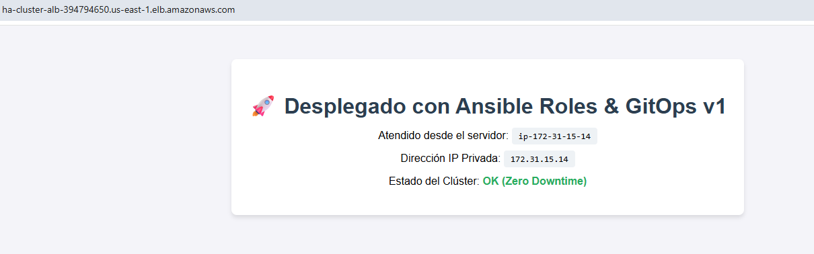
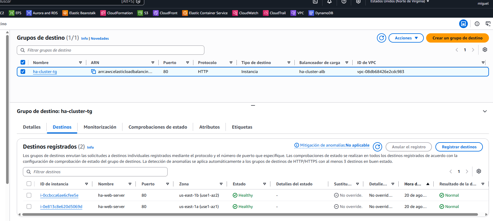
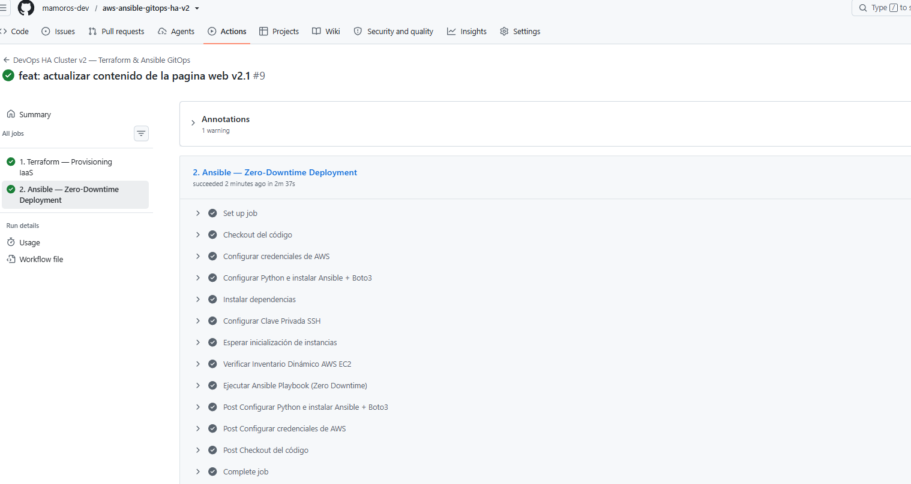
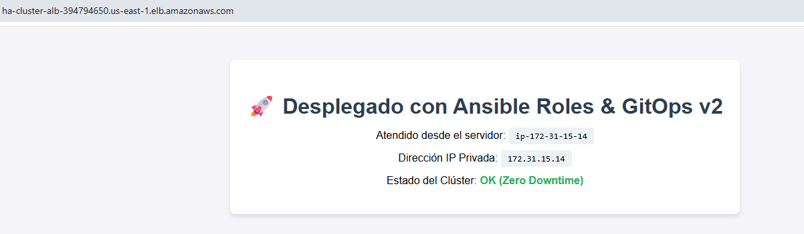
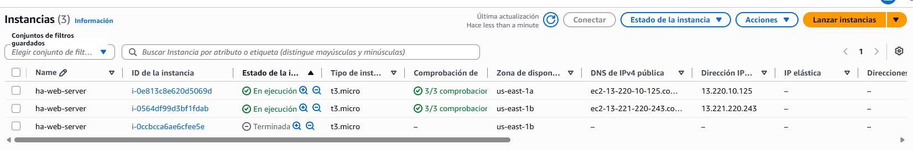
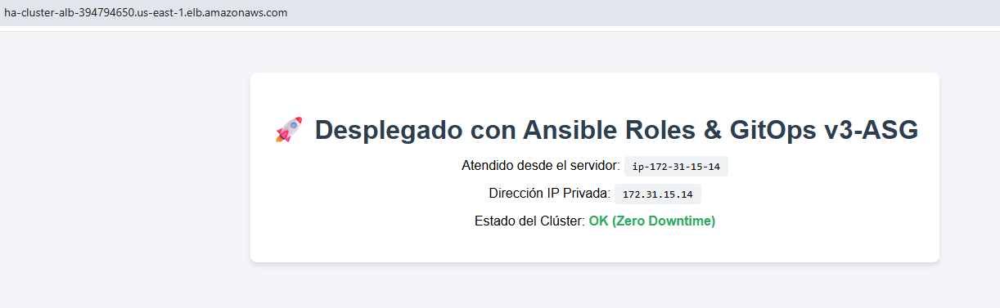

# 🚀 DevOps HA Cluster v2 — Terraform & Ansible GitOps (Zero-Downtime)

+ Este proyecto implementa una arquitectura de **Alta Disponibilidad (HA)** en AWS aplicando principios de **GitOps** e **Infraestructura como Código (IaC)**. 
+ El clúster despliega un grupo de servidores web Nginx detrás de un **Application Load Balancer (ALB)** respaldado por un **Auto Scaling Group (ASG)**, con aprovisionamiento dinámico y despliegue continuo sin tiempo de inactividad (**Zero-Downtime**) mediante **Ansible** y **GitHub Actions**.

## 📐 Arquitectura del Sistema

```text
               [ Cliente / Navegador ]
                          │
                          ▼
           [ Application Load Balancer (ALB) ]
                          │
            ┌─────────────┴─────────────┐
            ▼                           ▼
  [ EC2 - Webserver 1 ]       [ EC2 - Webserver 2 ]
  (Ubuntu + Nginx)            (Ubuntu + Nginx)
            └─────────────┬─────────────┘
                          ▲
                          │ (Ansible Inventory - Tag: Role=webservers)
           [ GitHub Actions CI/CD Pipeline ]
```
+ Application Load Balancer (ALB): Distribuye el tráfico HTTP públicamente entre las instancias EC2 saludables.
+ Auto Scaling Group (ASG): Garantiza un mínimo de 2 instancias distribuidas en múltiples Zonas de Disponibilidad (AZs).
+ Ansible Dynamic Inventory (`aws_ec2`): Descubre automáticamente las instancias en ejecución basándose en etiquetas (`tag:Role: webservers`).
+ Zero-Downtime Strategy (`serial: 1`): Ansible actualiza las máquinas de una en una para garantizar disponibilidad del 100%.

## 🛠️ Tecnologías Utilizadas
+ **Infraestructura como Código:** Terraform (Backend S3 + DynamoDB Lock).
+ **Gestión de Configuración:** Ansible (Roles, Jinja2, Inventario Dinámico AWS EC2).
+ **Proveedor Cloud:** AWS (VPC, Subnets, ALB, ASG, Launch Templates, Security Groups).
+ **CI/CD & GitOps:** GitHub Actions.
+ **Servidor Web:** Nginx sobre Ubuntu 22.04 LTS.

## 🧠 Decisiones de Arquitectura & Justificación

* **Estrategia Zero-Downtime (`serial: 1`):** Se configuró Ansible para actualizar las instancias del clúster de una en una. Esto garantiza que mientras una máquina se aprovisiona, la otra mantiene el 100% del tráfico web activo.
* **Separación de Responsabilidades (IaC vs GitOps):** Terraform se encarga exclusivamente de la infraestructura inmutable (red, ASG, ALB), mientras que Ansible gestiona la capa de software y archivos de configuración.
* **Health Check a Nivel de EC2 en ASG (`health_check_type = "EC2"`):** Se eligió validación por hardware/OS en lugar de HTTP directo en el ASG durante el arranque para evitar que AWS destruyera prematuramente máquinas que aún estaban en proceso de aprovisionamiento por SSH mediante Ansible.
* **Inventario Dinámico por Etiquetas (`tag:Role: webservers`):** Se eliminó el uso de IPs estáticas. Ansible descubre automáticamente las instancias vivas en AWS consultando la API dinámicamente antes de cada despliegue.

## 📁 Estructura del Repositorio
```bash
.
├── .github/
│   └── workflows/
│       ├── deploy.yml         # Pipeline de despliegue continuo (Terraform + Ansible)
│       └── destroy.yml        # Pipeline para destrucción de infraestructura
├── ansible/
│   ├── inventories/
│   │   └── aws_ec2.yml        # Inventario dinámico de AWS
│   ├── roles/
│   │   └── nginx_webserver/   # Rol para instalar y configurar Nginx
│   │       ├── tasks/
│   │       │   └── main.yml
│   │       └── templates/
│   │           └── index.html.j2
│   ├── ansible.cfg            # Configuración de Ansible y reintentos SSH
│   └── site.yml               # Playbook principal con estrategia Zero-Downtime
├── iac/
│   ├── main.tf                # Definición de la infraestructura en AWS
│   ├── variables.tf           # Declaración de variables
│   ├── outputs.tf             # Outputs (DNS del ALB, etc.)
│   └── terraform.tfvars       # Valores de variables (excluido en .gitignore)
└── README.md
```

## Pasos para Despliegue Automático (GitOps)
+ Clona el repositorio:
```Bash
git clone [https://github.com/tu-usuario/aws-ansible-gitops-ha-v2.git](https://github.com/tu-usuario/aws-ansible-gitops-ha-v2.git)
cd aws-ansible-gitops-ha-v2
```

+ Realiza cualquier cambio o simplemente haz un push a la rama main:
```Bash
git commit -m "feat: despliegue de infraestructura HA"
git push origin main
```
+ Observa en la pestaña Actions de GitHub cómo Terraform crea la infraestructura y Ansible configura el clúster.
+ Obtén el DNS del ALB desde la salida de GitHub Actions y abre la URL en tu navegador.

## 🧪 Pruebas de Validacion y Resultados
+ **Despliegue Automatizado y Balanceo de Carga**:
    - Al acceder al DNS del ALB, se verifica que las peticiones se distribuyen de forma alternada entre las direcciones IP privadas del clúster.  
      
      

+ **Estado de Salud en AWS Target Group**:
    - Verificación en la consola de AWS EC2 de que ambas instancias se encuentran registradas y reportando estado Healthy.  
      

+ **Pipeline de CI/CD en GitHub Actions**:
    - Ejecución limpia del pipeline completando la fase de Terraform Apply y el aprovisionamiento en serie mediante Ansible Playbook.  
      
      

+ **Prueba de Resiliencia y Auto-recuperación**:
    - Simulación de cambio de texto en la web y ver el despliegue Zero-Downtime
    
      
      

    - Simulación de fallo apoderándonos de una instancia (Terminate Instance). El ALB mantuvo el 100% del tráfico en la instancia superviviente sin caída del servicio, mientras el Auto Scaling Group lanzó una nueva EC2 y se re-integró al clúster tras la ejecución de Ansible.
      
      
    En este caso solo se mantiene la de esta IP.  
      
      
      
      
      

## ⚠️ Desafíos Técnicos Encontrados y Soluciones

Durante el desarrollo e integración continua surgieron varios retos de infraestructura real que fueron diagnosticados y resueltos:

### 1. Error `502 Bad Gateway` en el ALB
* **Causa:** Las instancias del ASG recién creadas no tenían Nginx instalado todavía, por lo que el ALB no tenía hosts saludables a los que redirigir tráfico.
* **Solución:** Implementación de pausas estratégicas (`sleep`) en el pipeline de CI/CD y tareas de verificación de puerto SSH (`wait_for`) en Ansible antes de la instalación de paquetes.

### 2. Incompatibilidad de Zonas de Disponibilidad en AWS (`us-east-1e`)
* **Causa:** AWS devolvía un fallo al intentar crear instancias `t3.micro` en la zona `us-east-1e` por falta de capacidad bajo demanda.
* **Solución:** Se aplicó un filtro en Terraform sobre `data "aws_subnets"` para restringir el despliegue únicamente a zonas compatibles (`us-east-1a`, `1b`, `1c`, `1d`, `1f`).

### 3. Falsos Positivos de SSH (`UNREACHABLE` / `Connection refused`)
* **Causa:** El proceso del sistema `cloud-init` de Ubuntu reiniciaba brevemente el demonio `sshd` durante el primer arranque de la máquina, cortando la sesión de Ansible.
* **Solución:** Se configuraron reintentos de conexión SSH automáticos (`retries = 3`) en `ansible.cfg` y un bloque `pre_tasks` que espera el readiness de SSH.

## 🧹 Destrucción de la Infraestructura
+ Para destruir todos los recursos creados en AWS y evitar costes:
    - Vía GitHub Actions:
        - Ir a Actions ➔ Destroy Infrastructure ➔ Run workflow.
    - Vía Terminal Local:
        ```Bash
        cd iac
        terraform init -reconfigure
        terraform destroy -auto-approve
        ```

## Stack

+ Terraform 1.15 · Checkov · Trivy · TFLint · AWS (VPC, EC2, ASG, ALB, RDS, IAM) · Systems Manager · Backend remoto en S3 + DynamoDB · GitHub Actions · OIDC · GitHub Environments

## Estado del Proyecto
* **Estado:** `Completado`
* **Resultado de Pruebas:** Aprovisionamiento, Balanceo de Carga y Test de Auto-recuperación/Kill Test aprobados.

## Autor

+ Miguel — [GitHub](https://github.com/mamoros-dev) · [LinkedIn](https://www.linkedin.com/in/miguel-amoros-moret/)