# 🚀 DevOps HA Cluster v2 — Terraform & Ansible GitOps (Zero-Downtime)

[](https://www.terraform.io/)
[](https://www.ansible.com/)
[](https://github.com/features/actions)
[](LICENSE)

🇪🇸 [Spanish version and more info](./docs/es/README-es.md)

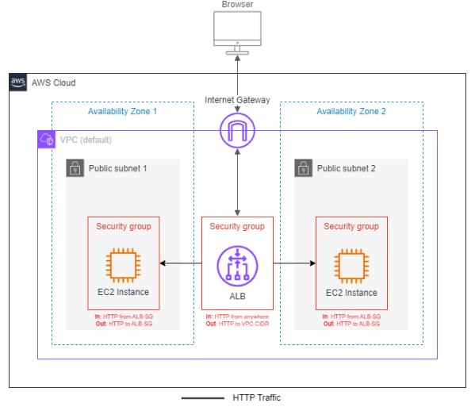  

+ Production-grade, highly available (HA) web architecture deployed across multiple Availability Zones in AWS. Infrastructure is provisioned using Terraform and configured via Ansible using dynamic EC2 inventory discovery and encrypted Vault secrets.
 
+ The cluster deploys a group of Nginx web servers behind an **Application Load Balancer (ALB)** backed by an **Auto Scaling Group (ASG)**, featuring dynamic provisioning and continuous, **zero-downtime** deployment using **Ansible** and **GitHub Actions**.

## Table of contents

- [Architecture Decisions](#architecture-decisions)
- [Infrastructure Verification](#infrastructure-verification)
- [How to install and run the project](#how-to-install-and-run-the-project)
- [How to use the project](#how-to-use-the-project)`
- [Stack](#stack)
- [Status](#status)
- [Author](#author)

## Architecture Decisions

* **Multi-AZ High Availability:** Infrastructure spans across two distinct Availability Zones (AZs) using public and private subnets behind an Application Load Balancer (ALB).
* **Stateless Web Tier:** EC2 instances are configured symmetrically via Ansible playbooks to ensure smooth traffic distribution and failover handling by the ALB.
* **Dynamic Inventory Management:** Ansible dynamically discovers target EC2 instances using AWS resource tags (`aws_ec2` plugin), removing the need for hardcoded IP addresses in static inventories.
* **Encrypted Configuration Secrets:** Sensitive configuration values and credentials managed within Ansible roles are encrypted at rest using Ansible Vault (`AES-256`).
* **Zero-Downtime Updates:** Sequential provisioning tasks and health-checked load balancer target groups allow rolling updates to web servers without service disruption.

## Infrastructure Verification

* **AWS ALB & Target Group Health:**
  All EC2 instances registered across multiple AZs and marked as `Healthy` in the target group:
  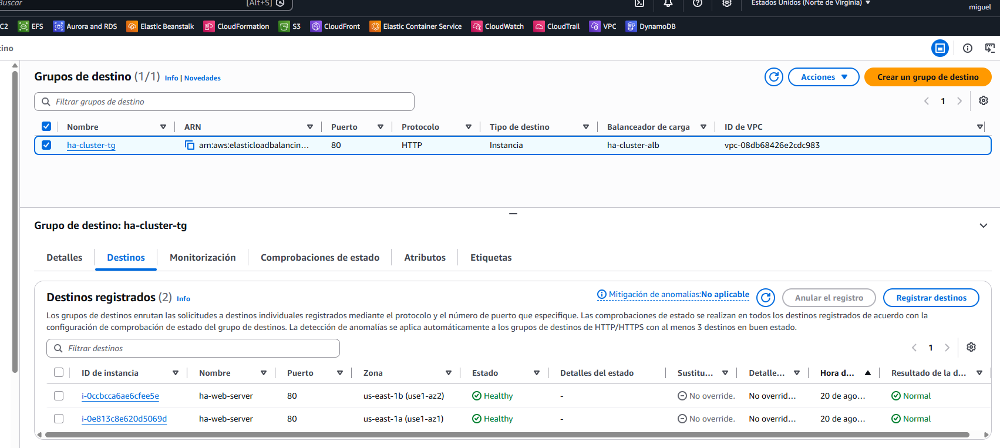

* **Ansible Dynamic Discovery & Playbook Execution:**
  Ansible dynamic inventory discovering instances and executing tasks cleanly:
  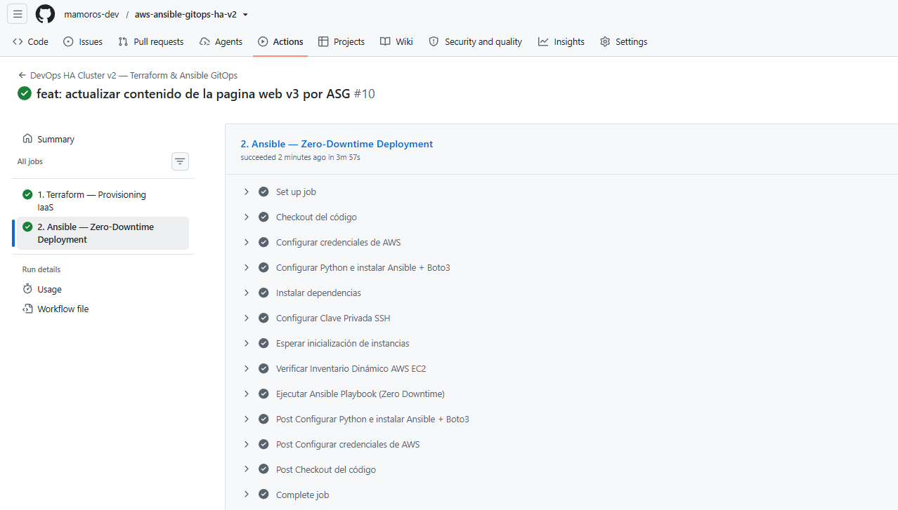

* **Web Application Verification:**
  Accessing the application through the ALB DNS endpoint showing dynamic host facts:
  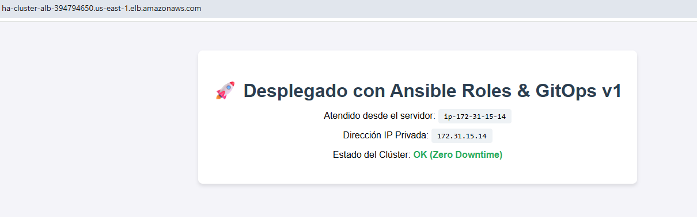  
  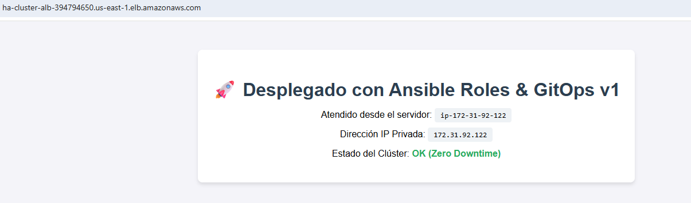  

* **Resilience and Self-Recovery Test**:
  Simulation of a web content update to demonstrate zero-downtime deployment
  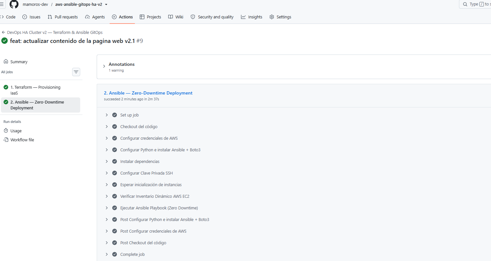
  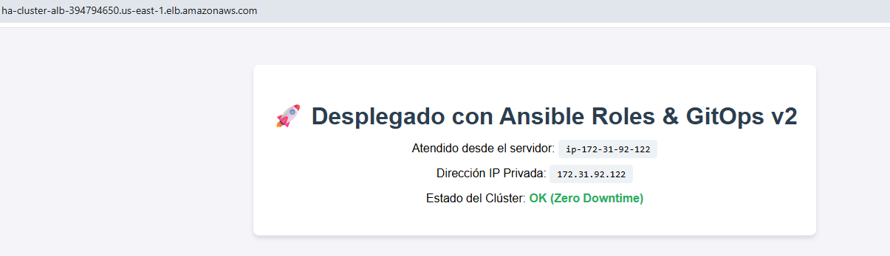  
  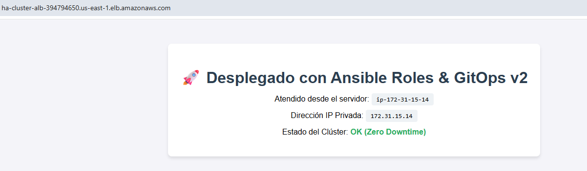  

  Failure simulation by terminating an instance. The ALB maintained 100% of the traffic on the surviving instance with no service interruption, while the Auto Scaling Group launched a new EC2 instance that rejoined the cluster following Ansible execution.
  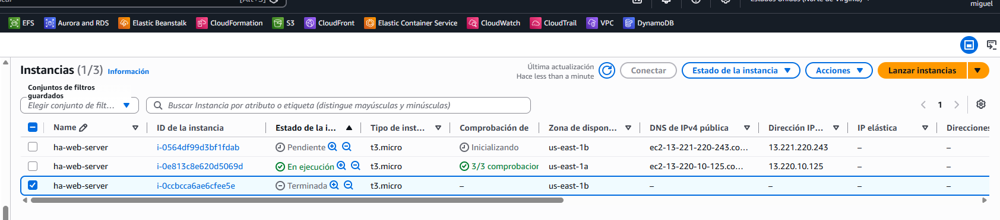  
    
  In this case, only the instance with this IP remains active.  
  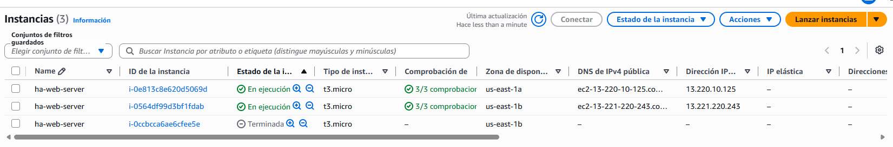  
    
  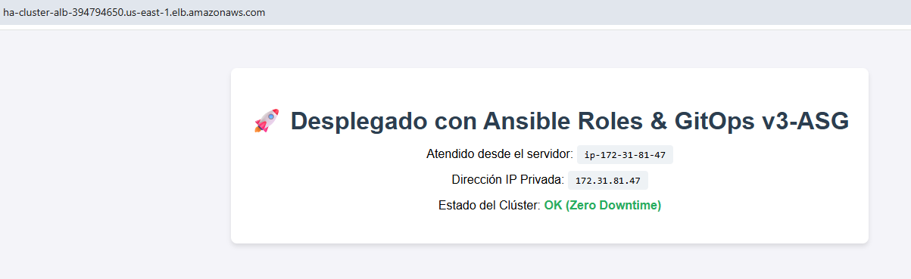  
  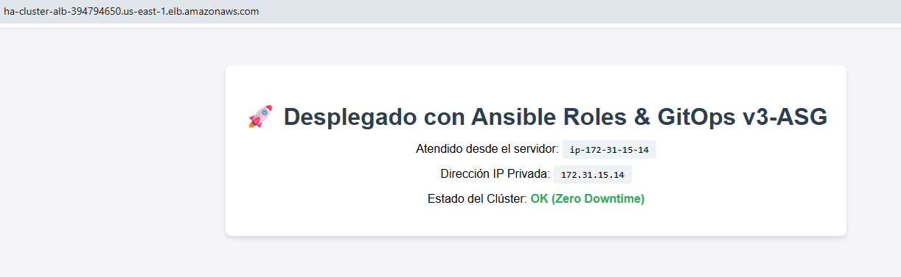  
  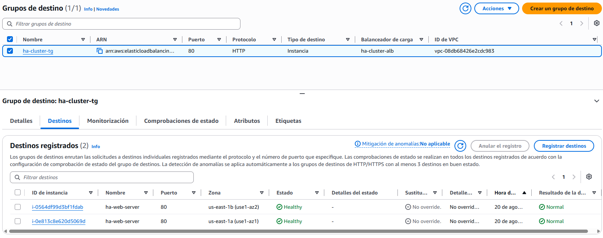

## How to install and run the project

### Option A: Automated Deployment via GitHub Actions

1. **Fork or Clone the repository:**
   ```bash
   git clone https://github.com/mamoros-dev/aws-ansible-gitops-ha-v2.git
   cd aws-ansible-gitops-ha-v2
   ```

2. **Configure GitHub Repository Secrets:**
    - Navigate to Settings -> Secrets and variables -> Actions and add:
        - `AWS_ACCESS_KEY_ID`: Your AWS IAM access key ID.
        - `AWS_SECRET_ACCESS_KEY`: Your AWS IAM secret access key.
        - `AWS_REGION`: Target AWS region (e.g., us-east-1).
        - `SSH_PRIVATE_KEY`: Private SSH key used by Ansible to connect to EC2 instances.
        - `SSH_PUBLIC_KEY`: Public SSH key injected into EC2 instances for deployment.

3. **Trigger Pipeline:**
    - Pull Requests: Opening a PR targeting `main` automatically runs syntax checks, security linting, and `terraform plan`.
    - Direct Merge / Push: Merging into `main` automatically executes `terraform apply` to provision multi-AZ AWS infrastructure and triggers the Ansible playbook via dynamic inventory.

### Option A: Manual CLI Deployment

1. **Provision AWS Infrastructure with Terraform:**
```Bash
cd iac/
terraform init
terraform plan -var="ssh_public_key=$(cat ~/.ssh/aws_ansible_key.pub)"
terraform apply -var="ssh_public_key=$(cat ~/.ssh/aws_ansible_key.pub)" -auto-approve
```
> Terraform provisions the VPC, Multi-AZ Subnets, Security Groups, EC2 instances, and ALB, tagging instances for dynamic discovery.  
> Change `aws_ansible_key.pub` for your SSH public key

2. **Verify Inventory & Run Configuration Management:**
```Bash
cd ../

# Verify AWS dynamic inventory discovers active EC2 instances
ansible-inventory -i ansible/inventories/aws_ec2.yml --graph

# Execute the playbook using the local vault password file
ansible-playbook -i ansible/inventories/aws_ec2.yml ansible/site.yml \
  --key-file ~/.ssh/aws_ansible_key \
  -u ubuntu \
  --ssh-common-args='-o StrictHostKeyChecking=no -o UserKnownHostsFile=/dev/null'
```

## How to use the project

Once the infrastructure and application servers are fully provisioned, follow these steps to verify and interact with the deployment.

1. Verify High Availability & Traffic Balancing
    Retrieve the Application Load Balancer (ALB) DNS name from the Terraform outputs or the AWS Management Console:
    ```Bash
    # Query the ALB endpoint
    curl -i http://<your-alb-dns-name>
    ```

    Execute multiple consecutive requests to verify that incoming traffic is distributed across EC2 instances spanning multiple Availability Zones:
    ```Bash
    # Loop multiple requests to inspect dynamic host response
    for i in {1..5}; do curl -s http://<your-alb-dns-name> | grep "Host Name"; done
    ```

2. Updating Infrastructure or Application State
    - To modify cloud resources: Update the .tf files under iac/terraform/.
    - To update OS configuration or web content: Edit the Ansible playbooks, roles, or templates under iac/roles/.
    - Push your changes to a feature branch and open a Pull Request to review the automated plan before merging.

3. Teardown & Resource Cleanup
To destroy all provisioned AWS resources and avoid unnecessary charges, execute:
    ```Bash
    cd iac/
    terraform destroy -var="ssh_public_key=$(cat ~/.ssh/aws_ansible_key.pub)" -auto-approve
    ```

## Stack
+ Terraform 1.15 · Checkov · Trivy · TFLint · AWS (VPC, EC2, ASG, ALB, RDS, IAM) · Systems Manager · Remote Backend on S3 + DynamoDB · GitHub Actions · OIDC · GitHub Environments

## Status
* **Status:** `Completed`
* **Test Results:** Provisioning, Load Balancing, and Self-recovery/Kill Test passed.

## Author
+ Miguel — [GitHub](https://github.com/mamoros-dev) · [LinkedIn](https://www.linkedin.com/in/miguel-amoros-moret/)